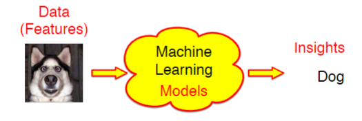
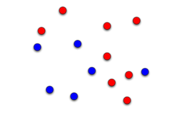
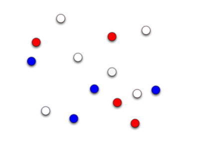

# Introduction to machine learning

## Reading:
* C. M. Bishop, Pattern Recognition and Machine Learning,Springer, 2007.

* [Computer Vision:  Models, Learning, and Inference](http://web4.cs.ucl.ac.uk/staff/s.prince/book/book.pdf "S. J. D. Prince.  Computer Vision:  Models, Learning, andInference.  Cambridge University Press.  2012")

* [Information Theory, Inference and LearningAlgorithms](http://www.inference.org.uk/mackay/itila/book.html "D. MacKay, Information Theory, Inference and LearningAlgorithms, 2003.")

## Useful materials:

* [Coursera: Machine Learning course](https://www.coursera.org/course/ml)

* [Follow this link and search for "machine learning summer school"](http://videolectures.net/)

## what is machine learning?
* Creating an algorithm to carry out a task without explicitly programming it to.

Note: Computer vision is often driven by machine learning

## Uses:
* spam detection in emails

* Predicting the weather from satellite images and environmental sensors.

* grouping images based on semantic similarity. (e.g. faces)

* Movie recommendations - Whether people like Arnold Schwarzenegger or action movies.
 
* Dimentionality reduction tool - take something complex like a face and plot it in 2 dimensions.

## Reasons:

Programming deterministically(manually) doesn't always work and sometimes its difficult or impossible to formalise as a computer science problem.
e.g. dificult to identify handwritting

## Three main ingredients of machine learning:

### Tasks:

* problems that require mapping(translating from one thing to another) from data to desired objects. (insights)

### Features:

* characteristics of the data used to describe domain objects 
  (the features within an image)

### Models:

* encode the required mapping

Figuring out what features are being analysed is important. Do you need edge detection or do you refer to pixels in an image. What parameters and models do you use.

## Classification:
* Binary (C = 2): classification involves seperating data into two distinct groups. e.g.(+ and -)
    * 'c' is the number of classifications

* Regression:
    * Involves mapping from data items to real values e.g.  quantifying the risk of heart disease based on personal health records. (It's like a prediction. predicting what something will be depending on real values given. e.g. satellite data for weather)

* Clustering:
    * grouping data as clusters based on their characteristics.
        * e.g.  grouping people according to their genetic characteristics.

* collaborative filtering
    * Identifying rules or associations from data.
        * e.g.  “recommending” diseases on the basis of patient records and diseases of similar patients.

* Dimensionality reduction
    * UNDERSTANDING YOUR DATA! ALWAYS LOOK AT YOUR DATA. GIVES YOU AN INSIGHT INTO THE PROBLEM.

## Supervised Learning:
In the supervised machine learning paradigm, each element of training data has associated labels.
* These labels are the correct output.

* e.g. binary classification: patient already labelled with "at risk of heart disease" or "not at risk with heart disease"

* The model should be good at generalising from training data. i.e. be good at predicting output for unseen data.

## Unsupervised Learning:
These do not require labels.

* It learns in a pattern based way. It looks at the similarities and differences in the data and features from the training data.
    * e.g.  clustering:  grouping people on basis of genetic similarityin order to discover interesting sub-groups.

## Degrees of supervision:
* The choice isn't always full/no supervision.
* Semi-supervised machine learning use labels only on a **subset** of the data. 

* This is important especially with labels that are expensive
    * A senario where this will be relevant: hiring scientists to individually label stars.
        * Expensive in terms of time and money.

## Data and features:
### Features are the inputs to machine learning:
* used to describe data objects
* represent particular characteristics of a piece of data
* maybe numerical (e.g.  age, weight, income), boolean (e.g.isemployed, ismale), or nominal (nationality).

### A model is only as good as its features !!!!!
* Choice of features is therefore extremely important
* Techniques for removing redundant features or transforming features in various ways are often crucial
