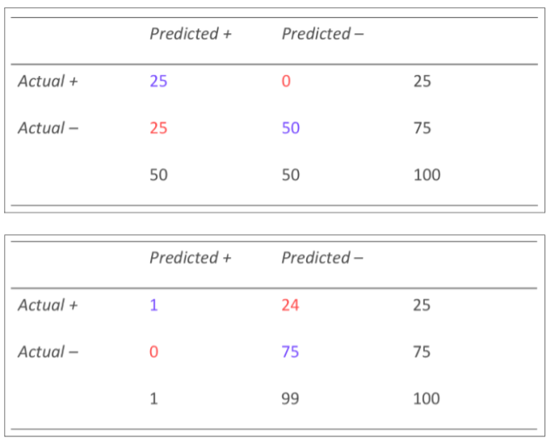

# Seminar Week 2: Answers:

## Question 2:
A machine learning model is understood as encoding a mapping from a space of instances to a space of labels.

name the following systems' instances(object of interest) and labels(Possible outputs):

- Email spam filter
    - instances - emails
    - labels - spam, not spam

- A program that learns to tell whether a photograph contains a face:
    - instances - photographs
    - labels - face, no face

- A program that learns to tell whether a photograph is of a particular person:
    - instances - 
    - labels -

- A system for predicting the price of houses:
    - instances - how much houses cost(most recent valuation of houses)
    - labels - prices of unseen houses (regression)

- A system for targeting supermarket customers with information about products that they might wish to buy:
    - It uses collaborative filtering
    - instances - customers, products they have bought
    - labels - The simliarity of one customers products to another. If they are similar purchases may use recommendations of products those customers were interested in.

## Question 3:

a) The overall accuracy of the classifier is:
    - (25 + 50) / 100 = 0.75 (75%)
    - (1 + 75) / 100 = 0.76 (76%)

- The first classifier was clsasified half incorrectly in the positive classification and 0 incorrectly in the negative classification.

- The second classifier is the opposite. They have similar accuracies but are good in opposite classfications

b) How do they differ in terms of precision and recall?  Calculate both measures for each contingency table to see.

- Table 1 precision and recall:
    - 

Table 2 precision and recall:
    - 

